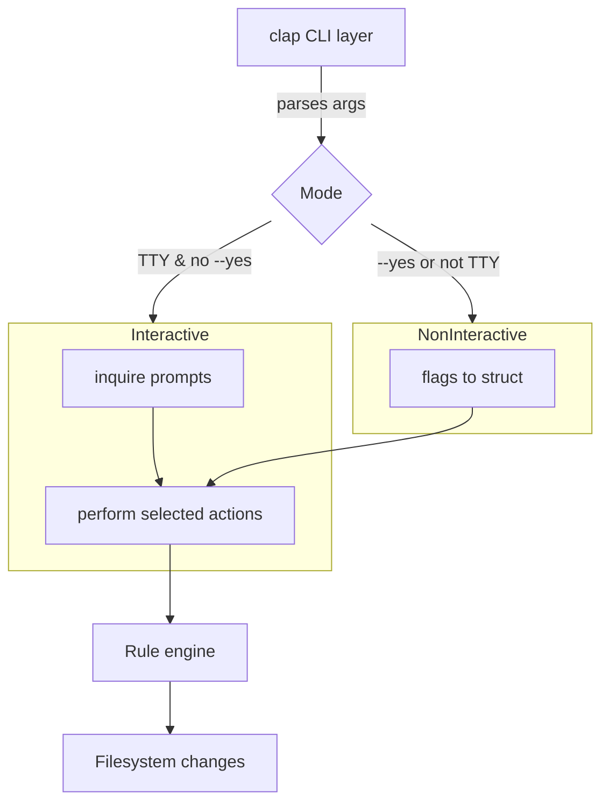

# cursor-rules Rewrite

> A simpler, more focused command-line tool for managing Cursor rules.

## Goals

1. Provide **two user experiences**:
   - **Interactive** (default when the binary is executed without a sub-command or when run in a TTY): relies on `inquire` for prompt-based selection—no TUI.
   - **Non-interactive** (script-friendly): controlled entirely through CLI flags.
2. Offer a quick way to add or update a predefined set of "Cursor rules" to any project directory.
3. Minimise dependencies and cognitive load—no more complex terminal UI layers.
4. Remain idiomatic, well-documented Rust with zero Clippy warnings.

---

## Command-line Interface (first draft)

```text
cursor-rules [OPTIONS] <COMMAND>

Options:
  -y, --yes             Assume "yes" for all prompts (non-interactive convenience)
      --config <FILE>   Use a custom rules config file (YAML/JSON)
  -q, --quiet           Reduce output to warnings & errors
  -v, --verbose ...     Increase log verbosity (-v, -vv, -vvv)
  -h, --help            Print help information
  -V, --version         Print version information

Commands:
  add          Add one or more rule sets to a project
  list         List available rule sets
  info <NAME>  Show details about a rule set
  completions  Generate shell completions for common shells
```

### Interactive `add` Workflow

1. **Detect project path** (default: current working directory). If ambiguous, ask the user.
2. **Browse & select rule files** through a *directory-style* navigator:
   - Top-level listing starts at: `backend/`, `devops/`, `frontend/`, `quick-add/`.
   - The user can **enter** a directory (↵) or **go back** (`⬅︎ ..`).
   - `Space` toggles selection of individual `.mdc` files or manifest files.
   - A breadcrumb or prompt header shows the current path to maintain context.
3. **Preview** the changes: files that will be copied/modified.
4. **Confirm** and apply.
5. **Done**: show summary and next steps.

### Interactive Mode – Sample Transcript

Below is an updated **representative** session that showcases the *directory-style* navigation.  Keyboard hints follow `inquire` conventions: ↑/↓ to move, ↵ to enter/open, ⬅︎ (left-arrow) to go back, and `Space` to toggle selection.

```console
$ cursor-rules                     # run with no sub-command → interactive mode
🎯  Target project: /Users/alice/my-app

? Choose an action
  ▸ Add rule sets to this project
    List available rule sets
    Exit

# ── Add rule sets ──────────────────────────────────────────────────────

ℹ  Loading rule index from GitHub (tkozzer/cursor-rules)… done.

# Root directory view ---------------------------------------------------
📁  backend/
📁  devops/
📁  frontend/
📁  quick-add/

? Browse rule repository  (/)
  ▸ backend/
    devops/
    frontend/
    quick-add/

# User presses ↵ on "frontend/" ----------------------------------------

📂 frontend/
  📁 general/
  📁 react/
  📁 vue/
  ⬅︎  ..  (back to /)

? Browse rule repository  (/frontend)
  ▸ react/
    general/
    vue/
    ⬅︎  ..

# User enters react/ then toggles two files ----------------------------

📂 frontend/react/
  ▢ react-core.mdc
  ▢ react-hooks.mdc
  ▢ tailwind-react.mdc
  ⬅︎  ..

? Select files to add  (/frontend/react)  [Space to select]
  ▣ react-core.mdc
  ▣ react-hooks.mdc
  ▢ tailwind-react.mdc
  ⬅︎  ..

# User presses ⬅︎ to go back to root and enters backend/rust -----------

📂 backend/rust/
  ▢ actix-web.mdc
  ▢ tokio-async.mdc
  ▢ rust-general.mdc
  ⬅︎  ..

? Select files to add  (/backend/rust)  [Space to select]
  ▣ actix-web.mdc
  ▢ tokio-async.mdc
  ▢ rust-general.mdc
  ⬅︎  ..

# Confirmation ----------------------------------------------------------

✔ 3 rule files selected.

? Preview changes before applying?
  ▸ Yes, show me the diff
    Apply immediately
    Cancel

# Diff preview is shown here …

? Proceed? (y/n) › y

✅  Rules copied successfully!  (3 files added)
```

Highlights:
• *Drill-down navigation* mimics a file explorer, always offering a `⬅︎  ..` entry to go up one level.
• Users may select files in multiple directories before confirming.
• The prompt header displays the current path for orientation.
• After selection, the usual **preview → confirm → apply** flow happens.

### Non-interactive `add` Examples

```bash
# Add linting + formatting rules to current project, skip prompts
cursor-rules add linting formatting --yes

# Same but against a specified path
cursor-rules -q add security --path ../backend
```

---

## Architecture Sketch



### Crates & Dependencies

| Purpose        | Crate        | Notes                         |
|----------------|--------------|-------------------------------|
| CLI parsing    | `clap`       | Derive API + `--help` output  |
| Prompts        | `inquire`    | For interactive selections    |
| Logging        | `tracing`    | Structured, hierarchical logs |
| Error handling | `anyhow`     | Context-rich errors           |
| Unit tests     | `assert_cmd` | CLI integration testing       |

---

## Rule Set Definition

* Stored as **YAML** files under a `rules/` directory.
* Each file represents a category (e.g. `linting.yaml`).
* Schema (draft):

```yaml
description: "Common Rust lints via Clippy"
actions:
  - type: copy
    from: templates/clippy.toml
    to:   .cargo/clippy.toml
```

The *rule engine* iterates over actions and performs them idempotently (skips if destination already matches).

---

## Roadmap / Next Steps

1. **Scaffold the project**
   - Initialise new binary crate (`cargo new --bin cursor-rules`).
   - Add baseline dependencies via `cargo add clap inquire tracing anyhow`.
2. **Implement CLI argument parsing** with `clap`.
3. **Detect runtime mode** (interactive vs non-interactive).
4. **Interactive flow** using `inquire` (MultiSelect, Confirm).
5. **Non-interactive execution path**.
6. **Rule engine MVP**: copy file actions.
7. **Unit & integration tests**.
8. **Documentation & examples** in `README.md`.

---

*Last updated: <!-- CURSOR_AUTOFILL_DATE -->* 